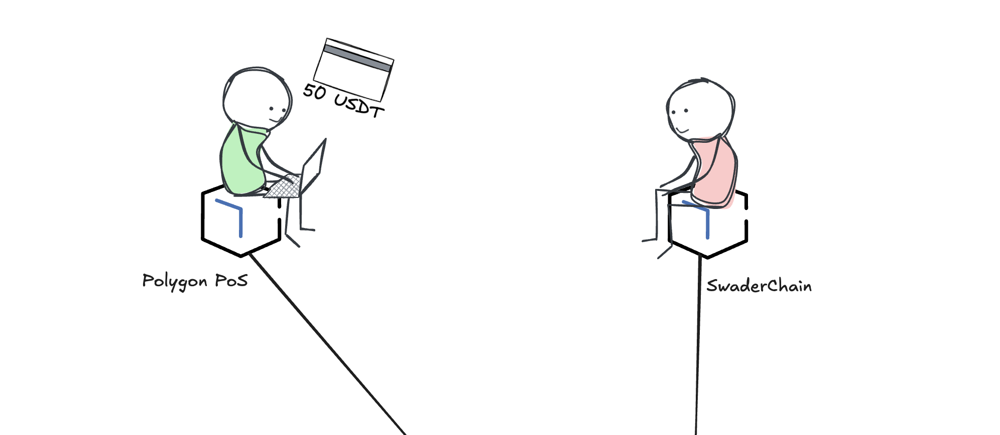
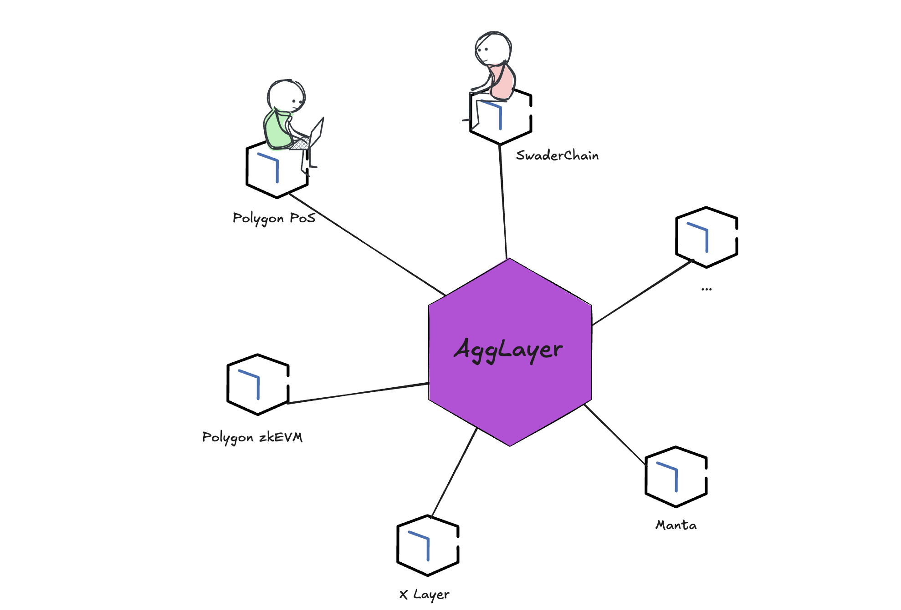

# A Day in the Life of an AggLayer Transaction

These are Alistair and Bob.

Alistair is a blockchain user. He has 100 USDT on Polygon PoS and wants to send
50 to Bob on SwaderChain.

Here we need to declare some assumptions before going further:

1. There exists a cool new wallet we'll call Zigil. All our users' interactions
   will be happening through the UI of this amazing new wallet.
2. The Polygon PoS chain and SwaderChain trust each other (defined when a chain
   joins the AggLayer) on the pre-confirmation stage level (Pragmatism). To
   learn more about different trust levels between chains, please read
   [Trust Levels Between AggLayer Chains](trust.md).
3. Tokens we want to interact with have already accepted their AggLayer version
   (their Unified-Bridge version) as canonical. Thus, when talking about
   "sending USDT", we are referring to USDT in the AggLayer ecosystem, and not
   wUSDT, axl.USDT, or any other wrapped or synthetic derivation.

Polygon PoS is the originator of the transaction, when Alistair attempts to send
50 USDT.

Since the chains technically do not see each other, we need a relayer. This is
where AggLayer comes in, which both Polygon PoS and SwaderChain are a part of.

The AggLayer can connect as many chains as will join it. There is no upper
limit. Due to the [AggLayer's architecture](overview.md), the 50 USDT message
will be traveling through several layers. Let's follow it along!

Once Alistair attempts to send 50 USDT, Zigil will first check if Alistair
has enough balance to send 50 USDT.

Then, Zigil will read the withdrawal state of Polygon PoS, making sure that the
balance is available. This is done through the Local Exit Tree.

## Local Exit Tree

All AggLayer chains will periodically automatically generate a Local Exit Tree
of withdrawals. These are submitted to the AggLayer to generate proof that the
Tree of a chain is correct. This Tree can also be sequenced by anyone and
submitted to the AggLayer for a reward if the central sequencer does not do it
in a specific time period.

Zigil uses this proof's validity to make sure that Polygon PoS has at least 50
USDT available for _burning_ (withdrawal).

## Reading State

Zigil will now read the L1 state of the AggLayer contracts, which for each token
contain a tuple of chain or rollup ID that the token originates from and its
contract address on that chain.

| Token | OriginChain | Address         |
|-------|-------------|-----------------|
| USDT  | Ethereum    | 0xSomeAddress   |
| POL   | Polygon POS | 0x0             |
| ETH   | Ethereum    | 0x0             |
| LINK  | Ethereum    | 0xSomeAddress|
| RMRK  | Moonbeam    | 0xSomeMoonbeamAddress|
| FREN  | Base    | 0xSomeBaseAddress|

The contracts will also note the withdrawable balance per each connected chain,
if non-zero.

| Chain        | Token | Balance |
|--------------|-------|---------|
| Polygon PoS  | USDT  | 20000   |
| Polygon PoS  | LINK  | 3000    |
| zkEVM        | USDT  | 10000   |
| SwaderChain  | USDT  | 0       |
| SwaderChain  | RMRK  | 100000  |
| SwaderChain  | FREN  | 40000   |
| BobChain     | USDT  | 200     |

The mainnet contracts are basically a "list" of all chains and their balances
for particular tokens. This is AggLayer's primary protection against
chain-hack-spillover, as explained on the
[Pessimistic Proof](pessimistic_proof.md) page.

At this point, Zigil knows that Polygon PoS has at least 50 USDT and that at
least this much belongs to Alistair. In the UI, it will allow Alistair to send
50 USDT. But how does it _send_ to another chain? Surely a blockchain isn't aware
of another blockchain's assets or its recipients?

Indeed, this is exactly why we need a unifying wallet to abstract away the need
to individually interact with each chain. So what does Zigil actually do now?

## Generating Intent

The _intent_ is for 50 USDT to arrive in Bob's wallet on SwaderChain. As such,
Zigil will create a batch of steps to be executed:

1. Burn 50 USDT on Polygon PoS in favor of the AggLayer, with a reference note
   to the next step.
2. Mint 50 USDT on SwaderChain in favor of Bob, with a reference note to the
   previous step.
3. Batch these two steps into a single transaction to be sequenced on the AggLayer.

With the intent now clear, we need proofs that these steps are valid for them to
execute. The AggLayer takes over by processing the batch.

## Authenticator, Prover, Aggregator, and Settler

An authenticator is a component which authenticates the block production of a
chain. Each chain provides its own authenticator to the AggLayer, such that the
AggLayer can run checks against it. If a block and the chain's Pessimistic Proof
are authenticated with the Prover, the Aggregator will aggregate them into a
single proof. This proof is then sent to the Settler, which will send it to the
L1 for final settlement.

In the phase before settling but after verifying proofs, the state of the chains
is still in the AggLayer. In [pragmatism](trust.md), this is the state that is
used. At this point, since SwaderChain has a pragmatic view of Polygon PoS, it
will use the state of Polygon PoS as it was when the block was produced. It will
not wait for the L1 to confirm the state transition, because the proofs alone
are enough to confirm that the state transition is valid.

## Minting and Burning

The batch is now unpacked and executed, making the following state transitions:

1. Burn 50 USDT on Polygon PoS
2. Reduce Polygon PoS's withdrawable USDT balance by 50
3. Mint 50 USDT on SwaderChain
4. Increase SwaderChain's withdrawable USDT balance by 50
5. Send 50 USDT on SwaderChain to Bob

After these steps, both chains will be generating a Local Exit Tree of
withdrawals to be submitted to the AggLayer as Pessimistic Proofs. This is done
to secure the unified bridge from hack spillovers. Further, both chains will be
generating a proof of their state transition to be validated by the
_authenticator_ of each chain.