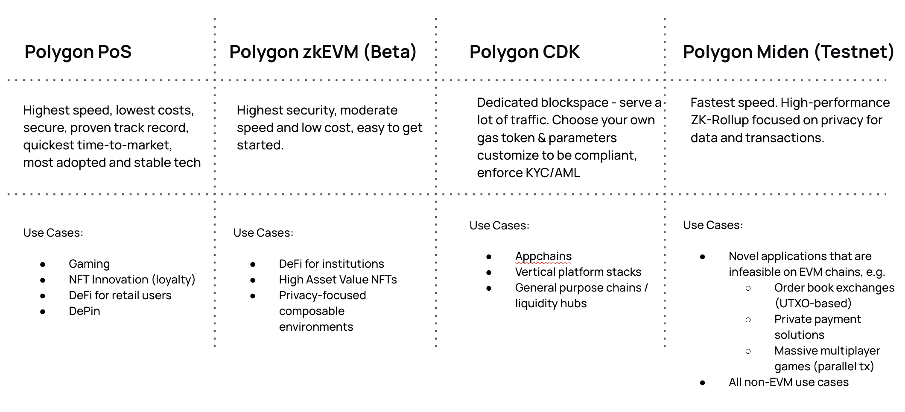

# The Polygon stack: Clarifying the choice

When entering the Polygon ecosystem, the choice of which stack to build on can
be daunting. This document aims to clarify the different options available and
help you make an informed decision.

Polygon CDK is a developer toolkit for designing ZK-powered Layer 2s which
inherit the security of the Ethereum mainnet, and play well with the
[AggLayer](../agglayer/overview.md). This enables these L2s to leverage
[unified liquidity](../agglayer/unified_liquidity.md) and the unlimited
composability the AggLayer makes possible.

With Polygon CDK you can build a custom blockchain with modules and core-level
modifications. Those can be so versatile they can enable teams to tweak anything
from account model to consensus algorithm to state transition function.

If you are looking to build an application on top of Polygon, two main options
are available, both inheriting the security of the Ethereum mainnet:

- [Polygon zkEVM](../zkevm/overview.md)
- [Polygon PoS](../pos/overview.md)

Polygon PoS is a proof-of-stake blockchain and a good choice if you are looking
to build a fast and low-cost application. Its massive ecosystem also makes it a
good target for DeFi applications, game projects, and other applications which
could benefit from hooking into a vibrant and popular environment.

Polygon zkEVM is a ZK-powered Layer 2. This can be a good choice if you're
looking to build a fast and cheap application while leveraging ZK to provide
validation and fast finality of off-chain transactions. With ZK progress ramping
up and zkEVM connecting to AggLayer, zkEVM gives builders the same connectivity
to a built-out ecosystem as PoS, but with a brand new architectural approach.
The zkEVM ecosystem is exploding, but the fact that it's new leaves room for
claiming some more first-mover-advantages. One caveat is that due to the nature
of ZK technology and its mathematical specificity, EVM and zkEVM aren't exactly
at full feature parity, so exercise some caution. For a full list of
differences, please see the
[zkEVM docs](https://docs.polygon.technology/zkEVM/spec/evm-differences/).

Polygon Miden is a zero-knowledge rollup for private, high-throughput
applications. It's a modular execution layer that extends Ethereum’s
capabilities using powerful features such as parallel transaction execution and
client-side proving.

Miden lets users prove state changes locally while the network only tracks a
commitment, leading to privacy and high-throughput. Users can also let the
operator prove public state changes like other rollups.

With Miden, developers can create novel, high-throughput, privacy-preserving
dApps for DeFi, RWA, and on-chain games with languages such as Rust and
TypeScript.

Which one should you choose? Consult the table below.

