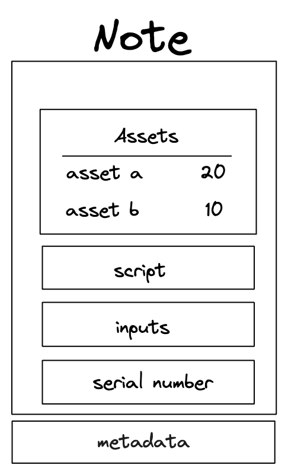

# Notes and Their Features

Notes in Miden are a fundamental component of its hybrid UTXO and account-based
state model, designed to enhance both parallel transaction execution and
privacy. Unlike Ethereum's account-based model, Miden's notes facilitate asset
interactions and transfers between accounts asynchronously and privately.

Each note in Miden can contain up to 256 assets, stored in a single hash, and
includes a script that defines the conditions for its consumption. This script,
executed during the transaction, ensures that the note can only be consumed if
specific conditions are met. Additionally, notes have inputs that can be
accessed by the note script, a unique serial number to prevent linkability, and
metadata such as the sender and note tag, which remain public regardless of the
note's storage mode.

The lifecycle of a note begins with its creation during transaction execution,
where it is recorded in the note database. Depending on the
[note's privacy setting](./note_types.md), the full note data (for public
notes), the encrypted note data (for encrypted notes) or just the note hash (for
private notes) is stored.

Notes can be produced and consumed locally by users or by the network operator
in a transaction. To consume a note, the transacting party must know the note
data to compute the nullifier, which, once verified, marks the note as consumed
in the nullifier database. This process ensures that notes can be managed
efficiently while maintaining the privacy and integrity of transactions within
the Miden network.

To learn more about the technical details of notes, you can refer to the
[Miden technical docs](https://docs.polygon.technology/miden/miden-base/architecture/notes).

Miden's approach to note efficiency is a key differentiator in the landscape of
privacy-focused blockchains by leveraging innovative techniques for note
discovery and management.

## Efficient Note Discovery

One of the standout features of Miden is its efficient note discovery process.
Unlike other systems that require decrypting all records to discover private
states, Miden uses a tagging mechanism to streamline this process.

### Tagging Mechanism

In Miden, each note is assigned a tag, which can be used to request notes. This
allows users to request a subset of all notes, significantly reducing the amount
of data that needs to be processed.

The tagging mechanism introduces some "fuzziness," meaning users may receive
some notes that are not theirs, but this can be controlled to balance privacy
and efficiency.

### User-Defined Tags

Users have the flexibility to choose their tags or use default strategies
provided by Miden. For example, a common strategy is to use the first 16 bits of
the user's account ID as a tag. This approach ensures that as the number of
accounts grows, the likelihood of tag collisions increases, enhancing privacy
through obfuscation.

### Requesting Notes

Users can request notes by their tags, allowing them to efficiently discover
which notes belong to them without downloading all notes. This process is not
only efficient but also privacy-preserving, as users can control the rate of
false positives and even request all notes if they wish to hide their interests
from the node.

## Conclusion

Miden's innovative approach to note management and discovery sets it apart in
the realm of privacy-focused blockchains. By leveraging public, private, and
encrypted notes, along with an efficient tagging mechanism, Miden ensures both
privacy and efficiency for its users. This design allows for a seamless and
secure user experience, making Miden a compelling choice for privacy-conscious
applications.
