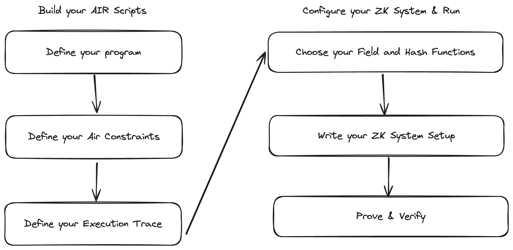
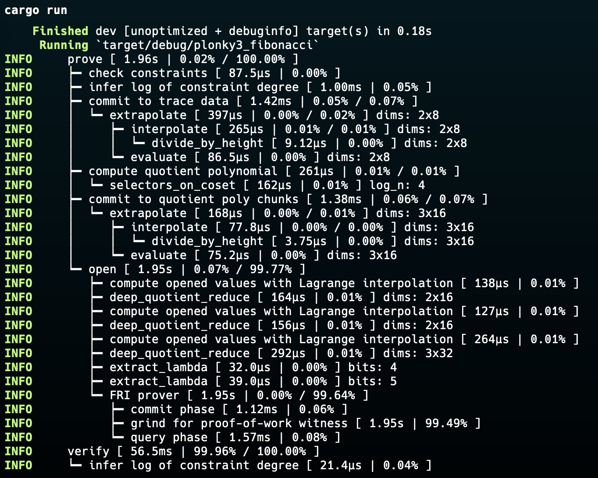

# Fibonacci in Plonky3 - Introduction to Plonky3

## Table of Contents
- [Fibonacci in Plonky3 - Introduction to Plonky3](#fibonacci-in-plonky3---introduction-to-plonky3)
  - [Table of Contents](#table-of-contents)
  - [Polygon Plonky3 Overview](#polygon-plonky3-overview)
  - [Understanding Plonky3](#understanding-plonky3)
  - [How does Plonky3 work?](#how-does-plonky3-work)
  - [Fibonacci AIR Example](#fibonacci-air-example)
    - [Step One: Define your Program](#step-one-define-your-program)
    - [Step Two: Define your AIR Constraints](#step-two-define-your-air-constraints)
    - [Step Three: Define your Execution Trace](#step-three-define-your-execution-trace)
    - [Step Four: Choose your Field and Hash Functions](#step-four-choose-your-field-and-hash-functions)
    - [Step Five: Write your ZK System Setup](#step-five-write-your-zk-system-setup)
    - [Step Six: Prove \& Verify](#step-six-prove--verify)
    - [Result](#result)
  - [Troubleshooting](#troubleshooting)
  - [Additional Resources](#additional-resources)
  - [Advanced Examples](#advanced-examples)

## Polygon Plonky3 Overview

[Plonky3](https://github.com/Plonky3/Plonky3) is a toolkit for implementing
polynomial IOPs (PIOPs), such as PLONK and STARKs, allowing developers to
configure a variety of to-spec implementations from a single ZK proving system.

Polygon Plonky3 supports several finite fields and hash functions. Currently,
the only supported polynomial commitment scheme is FRI, but future releases will
support several, including Brakedown.

## Understanding Plonky3

Plonky3 is a toolkit for designing a custom ZK proving implementation that can
then be used to power application-optimized zkVMs and zkEVMs.

In the same way an AI dev uses Pytorch and Tensorflow for building AI models,
Polygon Plonky3 provides the same flexibility for building ZK proving systems.
Polygon Plonky3 enables simple builds, such as the Fibonacci sequence prover in
this repo that requires only one AIR Script, to complex systems, such as SP1
from Succinct labs with multiple AIR scripts for different components of a
single zkVM.

## How does Plonky3 work?

Here's a TLDR version:

1. Define the computation using Algebraic Intermediate Representation (AIR).
2. Generate a trace of the computation based on the AIR.
3. Utilize efficient finite field implementations for arithmetic operations.
4. Apply Generalized Vector Commitment Schemes to create succinct
   representations of large vectors or polynomials.
5. Use polynomial commitment schemes like Circle PCS for compact polynomial representations.
6. Perform fast polynomial operations using FFTs and related algorithms.
7. Implement the FRI (Fast Reed-Solomon IOP) protocol to prove properties about
   committed polynomials.
8. Employ a challenger mechanism with the Fiat-Shamir heuristic for
   non-interactive proofs.
9. The unified STARK prover combines all components to generate the proof.
10. The verifier uses the same components to efficiently check the proof's validity.

Plonky3's modular design allows for easy customization and optimization of
different components, making it adaptable to various use cases and performance
requirements.

If this seems very complicated, don't worry, these are the underlying workflows
of Plonky3 based ZK systems. If you are builders who are using Plonky3, your main
job is at Step 1 and Step 2, the rest is just configuration!

## Fibonacci AIR Example

This example demonstrates how to implement a Fibonacci sequence calculator using
Algebraic Intermediate Representation (AIR) in Plonky3. AIR is a way to express
computations as polynomial constraints, which is crucial for creating
zero-knowledge proofs.

The Fibonacci sequence is a series of numbers where each number is the sum of
the two preceding ones, usually starting with 0 and 1. For example: 0, 1, 1, 2,
3, 5, 8, 13, ...

We will follow these steps:



### Step One: Define your Program

First you will need to understand what is the computation you want to prove. In
our case, it is a program that calculates a Fibonacci sequence after `n` steps.

Then we have requirements of:

1. The program must always start with 0 and 1 as the initial inputs
2. Each iteration will have two inputs and a output. The second input of the
   current input will become the first input of the next iteration, and the sum
   of the current two inputs will become the second input of the next iteration.
3. Will iterate `n` steps based on the configuration, and its result will be
   different according to numbers of steps iterated.

### Step Two: Define your AIR Constraints

Now that we have our program logic thought out, we will convert it into AIR Constraints.

AIR Constraints are about working with the execution trace, where you can imagine
it as a 2D-matrix.

Each row represents the current iteration of the computation, and the width of
each row represents the elements that are associated with the whole
computation. Basically, in a zkVM context, this could mean that the width of
the row is all the registers in this zkVM system, and each row iteration is
the transition of all registers from one PC count to next.

*Tips on defining your AIR Scripts:*

1. Define the valid state transition, aka what are the constraints when
   transitioning from one row to the one below it.
2. Define relations among the fields in the same row if needed. Sometimes we
   have constraints that are only about a single column as well, like if a
   column is supposed to be 0 or 1 we do x (x - 1) = 0 (or assert_bool()
   shorthand).
3. Define constraints on initial state, if the program has to be run starting
   with a specific initial state.
4. Define constraints on ending state, if the program result needs to be public
   at the end of execution in this program.

In our example, each row is the current 2 numbers to be added, so the width will
be 2. Every row will have a relation of:

1. Second field of the current row is the first field of the next row
2. The sum of the both fields of the current row is equal to the second field
   of the next row

We also need to make sure that our program starts with 0 and 1 for the correct
execution, as well as, verify the final execution result is the same as expected
result.

```rs
// Define your AIR constraints inputs via declaring a Struct with relevant inputs inside it.
pub struct FibonacciAir {
    pub num_steps: usize, // numbers of steps to run the fibonacci iterations
    pub final_value: u32, // precomputed final result after the numbers of steps.
}

// Define your Execution Trace Row size, 
impl<F: Field> BaseAir<F> for FibonacciAir {
    fn width(&self) -> usize {
        2 // Row width for fibonacci program is 2
    }
}

// Define your Constraints
impl<AB: AirBuilder> Air<AB> for FibonacciAir {
    fn eval(&self, builder: &mut AB) {
        let main = builder.main();
        let local = main.row_slice(0); // get the current row
        let next = main.row_slice(1); // get the next row

        // Enforce starting values
        builder.when_first_row().assert_eq(local[0], AB::Expr::zero());
        builder.when_first_row().assert_eq(local[1], AB::Expr::one());

        // Enforce state transition constraints
        builder.when_transition().assert_eq(next[0], local[1]);
        builder.when_transition().assert_eq(next[1], local[0] + local[1]);

        // Constrain the final value
        let final_value = AB::Expr::from_canonical_u32(self.final_value);
        builder.when_last_row().assert_eq(local[1], final_value);
    }
}
```

### Step Three: Define your Execution Trace

Third step is to define the function to generate your program's execution trace.
The general idea is to create a function that keeps track of all relevant state
of each iteration, and pushes them all into a vector, then at last convert this 1D
vector into a Matrix in the dimension that matches your AIR Script's width.

```rust
pub fn generate_fibonacci_trace<F: Field>(num_steps: usize) -> RowMajorMatrix<F> {
    // Declaring the total fields needed to keep track of the execution with the given parameter, which in this case, is num_steps multiply by 2, where 2 is the width of the AIR scripts.
    let mut values = Vec::with_capacity(num_steps * 2); 
    
    // Define your initial state, 0 and 1.
    let mut a = F::zero();
    let mut b = F::one();

    // Run your program and fill in the states in each iteration in the `values` vector
    for _ in 0..num_steps {
        values.push(a);
        values.push(b);
        let c = a + b;
        a = b;
        b = c;
    }

    // Convert it into 2D matrix.
    RowMajorMatrix::new(values, 2)
}
```

If you are curious how the execution trace looks like, here's the execution
trace of running 8 steps of Fibonacci program.

| col 0 | col 1 |
| ------ | ------ |
| 0 | 1 |
| 1 | 1 |
| 1 | 2 |
| 2 | 3 |
| 3 | 5 |
| 5 | 8 |
| 8 | 13 |
| 13 | 21 |

We now have both AIR scripts and execution trace ready.

### Step Four: Choose your Field and Hash Functions

It is time to start the layout of our ZK system. We first start with your
`Field` and `Hash Function` of choice.

The choice of field and hash function is crucial for the security and efficiency
of your zero-knowledge proof system.

```rs
// Your choice of Field
type Val = Mersenne31;

// This creates a cubic extension field over Val using a binomial basis. It's used for generating challenges in the proof system.
// The reason why we want to extend our field for Challenges, is because the original Field size is too small to be brute-forced to solve the challenge.
type Challenge = BinomialExtensionField<Val, 3>;

// Your choice of Hash Function
type ByteHash = Keccak256Hash;
// A serializer for Hash function, so that it can take Fields as inputs
type FieldHash = SerializingHasher32<ByteHash>;
// Declaring an empty hash and its serializer.
let byte_hash = ByteHash {};
// Declaring Field hash function, it is used to hash field elements in the proof system
let field_hash = FieldHash::new(Keccak256Hash {});
```

### Step Five: Write your ZK System Setup

This is a very generic setup and it's ready to be used in all kinds of ZK systems.
Generally, you can just copy paste the below code and use it in your own ZK
systems.

1. First setup is to define the Compression function, it is used in the MMCS
   (Multi-Merkle Commitment Tree) construction process.
2. Use the Field, Field Hash function and the compression function to create
   MMCS instance, we shall call this `ValMmcs`.
3. Extend the `ValMmcs` instance created from previous step into the same
   extension field as `Challenge` from Step Four, we call it `ChallangeMmcs`
4. Define a `Challenger` for Proof Generation (it's necessary in the PIOP
   process), which will be used in STARK configuration. Basically creating
   random challenge inputs for PIOP process.
5. Define `fri_config`, which is later used to create `Pcs` (Polynomial
   Commitment Scheme).
6. At last, with `Pcs`, `Challenge`, `Challenger` prepared, we use them to
   define our STARK configuration.

```rs
// Defines a compression function type using ByteHash, with 2 input blocks and 32-byte output.
type MyCompress = CompressionFunctionFromHasher<u8, ByteHash, 2, 32>;
// Creates a new instance of the compression function.
let compress = MyCompress::new(byte_hash);

// Defines a Merkle tree commitment scheme for field elements with 32 levels.
type ValMmcs = FieldMerkleTreeMmcs<Val, u8, FieldHash, MyCompress, 32>;
// Instantiates the Merkle tree commitment scheme.
let val_mmcs = ValMmcs::new(field_hash, compress);

// Defines an extension of the Merkle tree commitment scheme for the challenge field.
type ChallengeMmcs = ExtensionMmcs<Val, Challenge, ValMmcs>;
// Creates an instance of the challenge Merkle tree commitment scheme.
let challenge_mmcs = ChallengeMmcs::new(val_mmcs.clone());

// Defines the challenger type for generating random challenges.
type Challenger = SerializingChallenger32<Val, HashChallenger<u8, ByteHash, 32>>;

// Configures the FRI (Fast Reed-Solomon IOP) protocol parameters.
let fri_config = FriConfig {
    log_blowup: 1,
    num_queries: 100,
    proof_of_work_bits: 16,
    mmcs: challenge_mmcs,
};

// Defines the polynomial commitment scheme type.
type Pcs = CirclePcs<Val, ValMmcs, ChallengeMmcs>;
// Instantiates the polynomial commitment scheme with the above parameters.
let pcs = Pcs {
    mmcs: val_mmcs,
    fri_config,
    _phantom: PhantomData,
};

// Defines the overall STARK configuration type.
type MyConfig = StarkConfig<Pcs, Challenge, Challenger>;
// Creates the STARK configuration instance.
let config = MyConfig::new(pcs);
```

### Step Six: Prove & Verify

After the long process of defining the ZK setup, it's time to use it to prove
and verify our program!

```rs
// First define your AIR constraints inputs
let num_steps = 8; // Choose the number of Fibonacci steps.
let final_value = 21; // Choose the final Fibonacci value

// Instantiate the AIR Scripts instance.
let air = FibonacciAir { num_steps, final_value };
// Generate the execution trace, based on the inputs defined above.
let trace = generate_fibonacci_trace::<Val>(num_steps);

// Create Challenge sequence, in this case, we are using empty vector as seed inputs.
let mut challenger = Challenger::from_hasher(vec![], byte_hash);
// Generate your Proof!
let proof = prove(&config, &air, &mut challenger, trace, &vec![]);

// Create the same Challenge sequence as above for verification purpose
let mut challenger = Challenger::from_hasher(vec![], byte_hash);
// Verify your proof!
verify(&config, &air, &mut challenger, &proof, &vec![])
```

### Result

If all of the above code works, this is the output you can expect:

```bash
cargo run
```



## Troubleshooting

Common issues:

1. Incorrect final value: Ensure your Fibonacci calculation matches the AIR
   constraints
2. Proof verification failure: Double-check that the challenger initialization
   is identical for proving and verifying

## Additional Resources

- [STARKs Whitepaper](https://eprint.iacr.org/2018/046.pdf)
- [Plonky3 Documentation](https://github.com/Plonky3/Plonky3)
- [Introduction to AIRs](https://medium.com/starkware/arithmetization-i-15c046390862)

---

There are various other configurations you can explore in Plonky3:

Fields:

- Goldilocks
- BabyBear
- KoalaBear
- Mersenne31
- BN254

Hashes:

- Poseidon
- Poseidon2
- Rescue
- Monolith
- Keccak
- Blake3
- SHA-2

## Advanced Examples

If you want to check out the implementation of each combination, check the
example in
[keccak-air](https://github.com/Plonky3/Plonky3/tree/main/keccak-air). This is
an example implementation of Keccak (SHA-3) using the Plonky3 framework.
