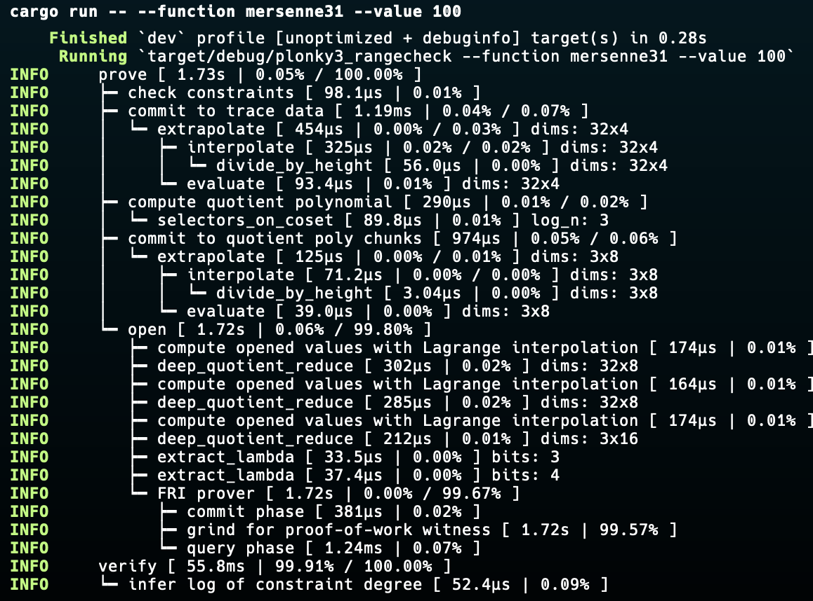
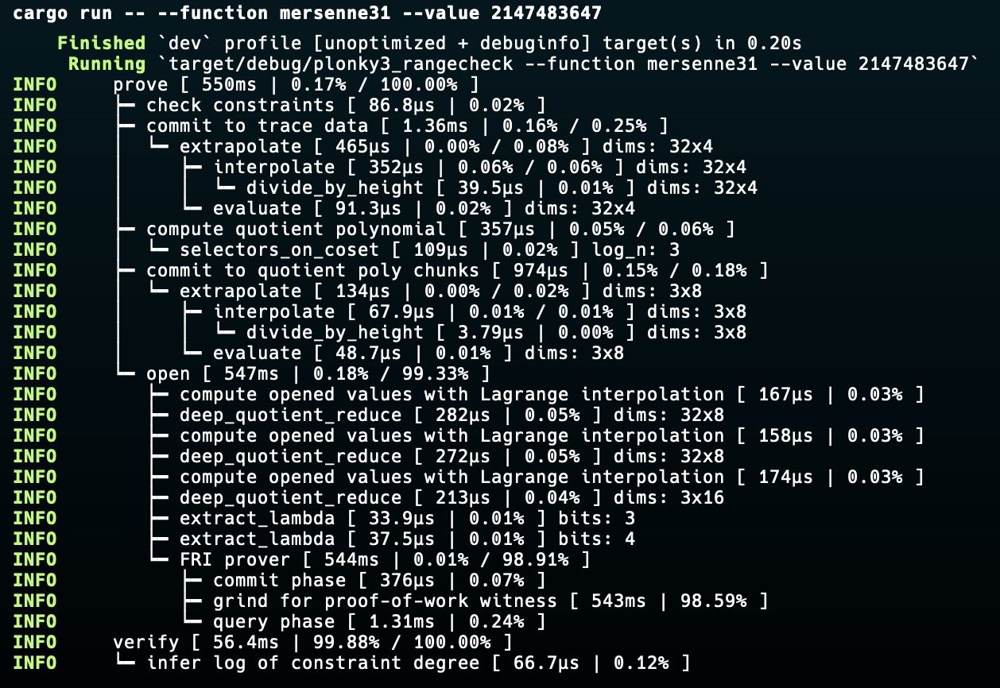
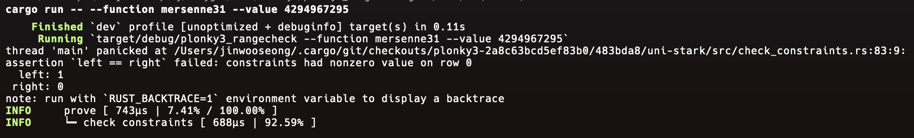
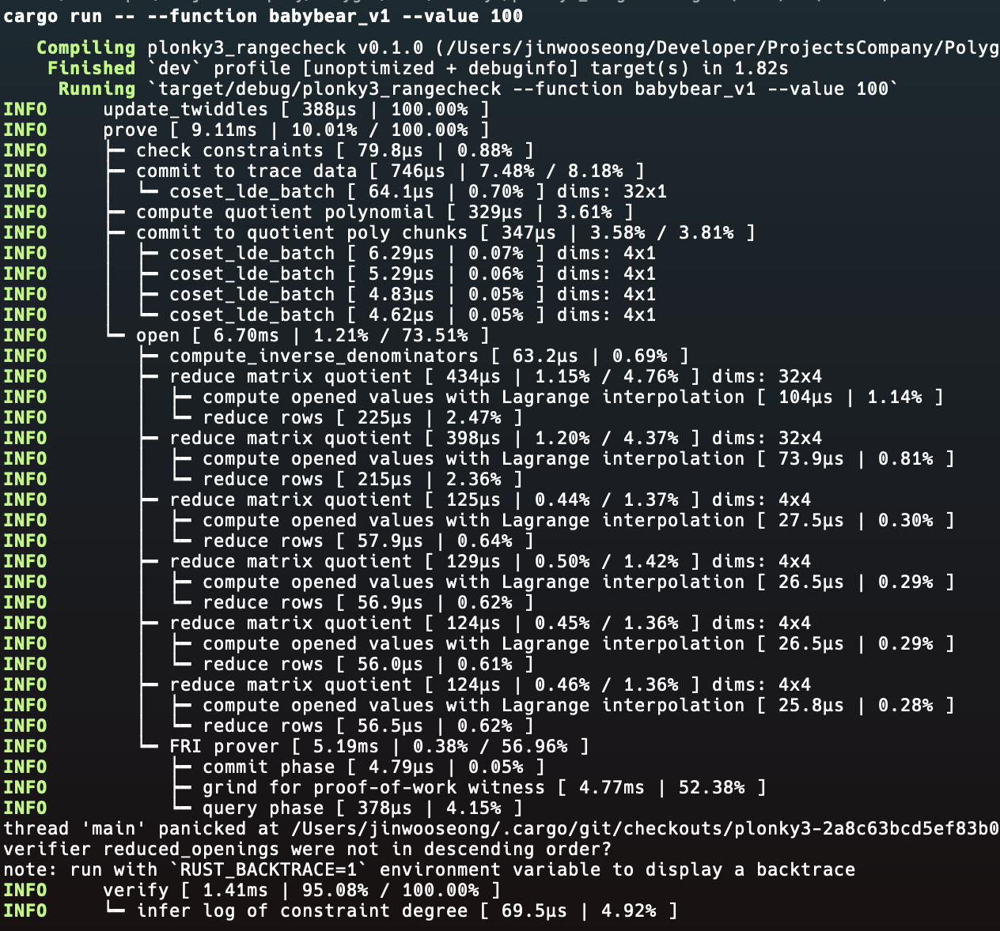
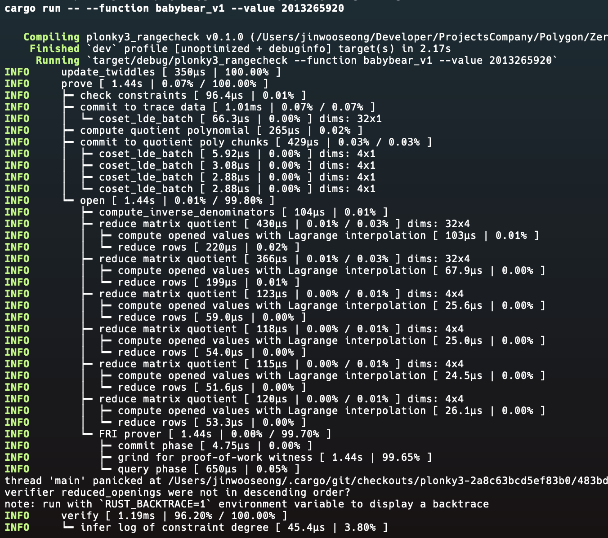
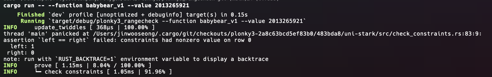

# Range Check in Plonky3 - Constrain Degree Design & Intermediate Variables

## Table of Contents
- [Range Check in Plonky3 - Constrain Degree Design \& Intermediate Variables](#range-check-in-plonky3---constrain-degree-design--intermediate-variables)
  - [Table of Contents](#table-of-contents)
  - [Introduction to Range Checks in Zero Knowledge Proofs](#introduction-to-range-checks-in-zero-knowledge-proofs)
  - [Plonky3 Range Check Implementations](#plonky3-range-check-implementations)
  - [Mersenne31 (m31) Range Check](#mersenne31-m31-range-check)
    - [Overview](#overview)
    - [Execution Trace](#execution-trace)
    - [Constraints](#constraints)
    - [Proof \& Verify](#proof--verify)
      - [Test the range with number 100: (inside the range)](#test-the-range-with-number-100-inside-the-range)
      - [Test the range with number $2^{31}-1$: (MAX number of the range)](#test-the-range-with-number-231-1-max-number-of-the-range)
      - [Test the range with number $2^{32}-1$: (Over the range)](#test-the-range-with-number-232-1-over-the-range)
  - [BabyBear Range Check (v1): A Basic Implementation](#babybear-range-check-v1-a-basic-implementation)
    - [Overview](#overview-1)
    - [Execution Trace](#execution-trace-1)
    - [Constraints](#constraints-1)
    - [Proof \& Verify](#proof--verify-1)
      - [Test the range with number 100: (inside the range)](#test-the-range-with-number-100-inside-the-range-1)
      - [Test the range with number $2^{31}-2^{27}$: (MAX number of the range)](#test-the-range-with-number-231-227-max-number-of-the-range)
      - [Test the range with number $2^{31}-2^{27}+1$: (Over the range)](#test-the-range-with-number-231-2271-over-the-range)
  - [Goldilocks v1 Range Check](#goldilocks-v1-range-check)
    - [Overview](#overview-2)
    - [Execution Trace](#execution-trace-2)
    - [Constraints](#constraints-2)
    - [Proof \& Verify](#proof--verify-2)
      - [Test the range with number 100: (inside the range)](#test-the-range-with-number-100-inside-the-range-2)
      - [Test the range with number $2^{64}-2^{32}$: (MAX number of the range)](#test-the-range-with-number-264-232-max-number-of-the-range)
      - [Test the range with number $2^{64}-2^{32}+1$: (Over the range)](#test-the-range-with-number-264-2321-over-the-range)
  - [BabyBear v2 Range Check \& Constraint Degree Comparison](#babybear-v2-range-check--constraint-degree-comparison)
    - [Overview](#overview-3)
    - [Constraint Degree](#constraint-degree)
    - [BabyBear v1: A Degree-4 constraint](#babybear-v1-a-degree-4-constraint)
    - [BabyBear v2: A Degree-2 Constraint](#babybear-v2-a-degree-2-constraint)
    - [Proof \& Verify](#proof--verify-3)
      - [Tested with following inputs using `release` version:](#tested-with-following-inputs-using-release-version)
  - [Conclusion](#conclusion)
  - [Goldilocks v2 Range Check?](#goldilocks-v2-range-check)


## Introduction to Range Checks in Zero Knowledge Proofs

Range checks are fundamental operations in zero-knowledge proof systems. They allow us to prove that a value lies within a specific range without revealing the actual value. This is crucial for many applications, including:

1. Privacy-preserving financial transactions
2. Secure voting systems
3. Age verification without revealing exact birth dates
4. Salary range proofs for loan applications
5. zkVM word size checking
6. and more...

In the context of zero-knowledge proofs, a range check typically involves proving that a number is less than a certain value or falls within a specific interval.

## Plonky3 Range Check Implementations
If you are building any of the above systems on top of Plonky3, there are several ways to build range check constraints for different range and have it optimized. In this tutorial, I have created 4 examples, where each tailored to different finite fields and optimization levels. We'll explore four implementations, progressing from simple to more complex:

- Mersenne31 (m31) - The simplest implementation of the series, implementation for Mersenne31 field range check
- BabyBear v1 - A basic implementation for the BabyBear field
- Goldilocks v1 - Range check for the Goldilocks field
- BabyBear v2 - An optimized version of BabyBear field

> These examples were ran on M2 Pro Max MacBook Pro with 16GB of RAM.

## Mersenne31 (m31) Range Check

### Overview

The Mersenne31 range check is the simplest implementation in our series. It's based on the Mersenne prime $2^{31}-1$, which allows for efficient arithmetic operations. The range check ensures that the value is less than $2^{31}-1$. 

Plonky3 Settings:
- **Field**: Mersenne31
- **Hash**: Keccak256
- **PCS**: CirclePcs

### Execution Trace

|row\col|0 col|1 col|2 col|3 col|4 col|5 col|6 col|7 col|8 col|9 col|10 col|11 col|12 col|13 col|14 col|15 col|16 col|17 col|18 col|19 col|20 col|21 col|22 col|23 col|24 col|25 col|26 col|27 col|28 col|29 col|30 col|31 col|
|-|-|-|-|-|-|-|-|-|-|-|-|-|-|-|-|-|-|-|-|-|-|-|-|-|-|-|-|-|-|-|-|-|
|0 row|0|1|1|1|1|1|1|1|1|1|1|1|1|1|1|1|1|1|1|1|1|1|1|1|1|1|1|1|1|1|1|1|
|1 row|0|0|0|0|0|0|0|0|0|0|0|0|0|0|0|0|0|0|0|0|0|0|0|0|0|0|0|0|0|0|0|0|
|2 row|0|0|0|0|0|0|0|0|0|0|0|0|0|0|0|0|0|0|0|0|0|0|0|0|0|0|0|0|0|0|0|0|
|3 row|0|0|0|0|0|0|0|0|0|0|0|0|0|0|0|0|0|0|0|0|0|0|0|0|0|0|0|0|0|0|0|0|

We are using `0th` row as the row to store the number to be checked, in the above execution trace example, its storing the number $2^{31}-1$. It is stored in bit decomposition form(We will explain why we are using bit decomposition in later section), in big endian format. The rest of the rows are filled with zeros.

*The reason why we need extra three rows is because the CirclePCS requires at least 4 rows to generate proof.*

```rust
pub fn generate_mersenne31_trace<F: Field>(value: u32) -> RowMajorMatrix<F> {
    let mut bits = Vec::with_capacity(32 * 4); // 32 bits per row, 4 rows, CirclePCS requires 4 rows
    // Convert the value to binary, in big endian format
    for i in (0..32).rev() {
        if (value & (1 << i)) != 0 {
            bits.push(F::one());
        } else {
            bits.push(F::zero());
        }
    }
    // Adding three extra rows of zeros
    for _ in 0..32*3 {
        bits.push(F::zero());
    }
    RowMajorMatrix::new(bits, 32)
}

```

### Constraints

For constraints in range checks in m31, there are several conditions to satisfy:
1. **The most significant bit is zero**: Guaranteeing the value is less than 2^31.
2. **Each bit is either 0 or 1**: Since we are using bit decomposition, we need to make sure every value in col 1 to col 31 is either 0 or 1.
3. **The reconstructed value matches the input**: The reconstructed value from the bit decomposition should match the original value.
4. **(Optional) Checking the sum of the remaining three rows is zero**: This is to ensure that the sum of the remaining three rows is zero. The reason why this is optional is because regardless of the value of the remaining three rows, the proofs result is not affected. *In this example, I am only showing this process as an example to show how the constraint works.*

> Note: in Plonky3, `when_transition()` is not applied when checking the last row iteration, therefore if you want to check constraints in the last row, you need to use `when_last_row()`

```rust
pub struct Mersenne31RangeCheckAir {
    pub value: u32, // define constraint input, value is assigned to check against the reconstructed value.
}

// Mersenne31 Modulus in big endian format
// 01111111 11111111 11111111 11111111
// 2^31 - 1
impl<F: Field> BaseAir<F> for Mersenne31RangeCheckAir {
    fn width(&self) -> usize {
        32 // 1 number per row
    }
}

impl<AB: AirBuilder> Air<AB> for Mersenne31RangeCheckAir {
    fn eval(&self, builder: &mut AB) {
        let main = builder.main();
        let current_row = main.row_slice(0);
        let next_row = main.row_slice(1);

        // Assert that the most significant bit is zero, only checked when its first row
        builder.when_first_row().assert_eq(current_row[0], AB::Expr::zero());

        // initializing the `reconstructed_value` and the `next_row_sum`
        let mut reconstructed_value = AB::Expr::zero();
        let mut next_row_rowsum = AB::Expr::zero();
        for i in 0..32 {
            let bit = current_row[i];
            builder.assert_bool(bit); 
            reconstructed_value += AB::Expr::from_wrapped_u32(1 << (31-i)) * bit; // using `from_wrapped_u32` to make sure the value is in range of 31 bits.
            next_row_rowsum += next_row[i].into(); // converting the input to Expr and adding it to the sum.
        }

        // Assert if the reconstructed value matches the original value, only checked when its first row
        builder.when_first_row().assert_eq(AB::Expr::from_wrapped_u32(self.value), reconstructed_value);
        // Assert if the sum of each remaining row is zero in every transition. 
        builder.when_transition().assert_eq(next_row_rowsum, AB::Expr::zero());
    }
}
```

### Proof & Verify

The Plonky3 Prover & Verifier config can be found in `m31.rs` file. We will explore configuration in details in later chapters, for now we are going to use the template we provided in [here](https://github.com/Plonky3/Plonky3/tree/main/keccak-air/examples).

#### Test the range with number 100: (inside the range)

```bash
cargo run -- --function mersenne31 --value 100 
```



> Successfully verified! Proving time is `1.73s` and Verification time is `55.8ms`.

#### Test the range with number $2^{31}-1$: (MAX number of the range)

```bash
cargo run -- --function mersenne31 --value 2147483647
```



> Successfully verified! Proving time is `550ms` and Verification time is `56.4ms`.

#### Test the range with number $2^{32}-1$: (Over the range)

```bash
cargo run -- --function mersenne31 --value 4294967295
```



> Proof Generation failed! Since its significant bit is 1, it is out of range.

## BabyBear Range Check (v1): A Basic Implementation

### Overview

BabyBear is a field designed for efficient STARK proofs. The v1 implementation of the BabyBear range check introduces more complex constraints than the previous Mersenne31 range check example.
BabyBear has a modulus of 0x78000001($2^{31}-2^{27}$), which is a 32-bit prime. The range check in BabyBear v1 introduces more complex constraints to handle the specific structure of the field.

Plonky3 Settings:
- **Field**: BabyBear
- **Hash**: Keccak256
- **PCS**: TwoAdicFriPcs

### Execution Trace

|row\col|0 col|1 col|2 col|3 col|4 col|5 col|6 col|7 col|8 col|9 col|10 col|11 col|12 col|13 col|14 col|15 col|16 col|17 col|18 col|19 col|20 col|21 col|22 col|23 col|24 col|25 col|26 col|27 col|28 col|29 col|30 col|31 col|
|-|-|-|-|-|-|-|-|-|-|-|-|-|-|-|-|-|-|-|-|-|-|-|-|-|-|-|-|-|-|-|-|-|
|0 row|0|1|1|1|1|0|0|0|0|0|0|0|0|0|0|0|0|0|0|0|0|0|0|0|0|0|0|0|0|0|0|0|0|

We are using `0th` row as the row to store the number to be checked, in the above execution trace, its storing the number $2^{31}-2^{27} + 1$. It is stored in bit decomposition form, in big endian format. In this example, it doesn't require addition rows, since we are not using `CirclePcs`.

```rust
pub fn generate_trace<F: Field>(value: u32) -> RowMajorMatrix<F> {
    let mut bits = Vec::with_capacity(32); // 32 bits per row
    // Convert the value to binary, in big endian format
    for i in (0..32).rev() {
        if (value & (1 << i)) != 0 {
            bits.push(F::one());
        } else {
            bits.push(F::zero());
        }
    }
    RowMajorMatrix::new(bits, 32)
}
```

### Constraints

For constraints in range checks in BabyBear, there are several conditions to satisfy:
1. **The most significant bit is zero**: Guaranteeing the value is less than 2^31.
2. **Check if bits from 1st to 4th are one**: If its true, then remaining bits must be zero.
3. **Check if the reamaining bits are zero**: If 2nd contraint is true, the has to be all zero, other wise it can be anything between 1 or zero.
4. **Each bit is either 0 or 1**: Since we are using bit decomposition, we need to make sure every value in col 1 to col 31 is either 0 or 1.
5. **The reconstructed value matches the input**: The reconstructed value from the bit decomposition should match the original value.

```rust
pub struct BabyBearRangeCheckAir {
    pub value: u32, // define constraint input, value is assigned to check against the reconstructed value.
}

// Baby Bear Modulus in big endian format
// 01111000 00000000 00000000 00000001
impl<F: Field> BaseAir<F> for BabyBearRangeCheckAir {
    fn width(&self) -> usize {
        32
    }
}

impl<AB: AirBuilder> Air<AB> for BabyBearRangeCheckAir {
    fn eval(&self, builder: &mut AB) {
        let main = builder.main();
        let current_row = main.row_slice(0);

        // Assert that the most significant bit is zero
        builder.assert_eq(current_row[0], AB::Expr::zero());

        // Value to check if the 1st to 4th bits are all one
        let upper_bits_product = current_row[1..5].iter().map(|&bit| bit.into()).product::<AB::Expr>();
        // Value to check if the sum of the remaining bits is zero, only if `upper_bits_product` is 1.
        let remaining_bits_sum = current_row[5..32].iter().map(|&bit | bit.into()).sum::<AB::Expr>();
        
        // Assert if the 1st to 4th bits are all one, then `remaining_bits_sum` has to be zero.
        builder.when(upper_bits_product.clone()).assert_zero(remaining_bits_sum);

        // initializing the `reconstructed_value`
        let mut reconstructed_value = AB::Expr::zero();
        for i in 0..32 {
            let bit = current_row[i];
            // Making sure every bit is either 0 or 1
            builder.assert_bool(bit);
            reconstructed_value += AB::Expr::from_wrapped_u32(1 << (31-i)) * bit; // using `from_wrapped_u32` to make sure the value is in range of 32 bits.
        }

        // Assert if the reconstructed value matches the original value
        builder.when_first_row().assert_eq(AB::Expr::from_wrapped_u32(self.value), reconstructed_value);
    }
}
```

### Proof & Verify

The Plonky3 Prover & Verifier config can be found in `babybear_v1.rs` file. We had to change the `fri_config`'s `log_blowup` from `1` to `2`, since the degree of the constraint is 4. We will explore this topic in the BabyBear v2 section and how to optimize it.

#### Test the range with number 100: (inside the range)

```bash
cargo run -- --function babybear_v1 --value 100
```



> Successfully verified! Proving time is `9.11ms` and Verification time is `1.41ms`.

> You might wonder what is that `panicked` message, it is a logging message since we are running it in debug mode. You can run the program with `cargo run --release -- --function babybear_v1 --value 100` to examine the program in release mode without the logging message. The performance of debugging mode and release mode is actually quite different as well.

#### Test the range with number $2^{31}-2^{27}$: (MAX number of the range)

```bash
cargo run -- --function babybear_v1 --value 2013265920
```



> Successfully verified! Proving time is `1.44s` and Verification time is `1.19ms`.

#### Test the range with number $2^{31}-2^{27}+1$: (Over the range)

```bash
cargo run -- --function babybear_v1 --value 2013265921
```



> Proof Generation failed! Since the remaining bits sum is not zero.

## Goldilocks v1 Range Check

### Overview
The Goldilocks field is another field used in zero-knowledge proofs. It has a modulus of $2^{64}−2^{32}+1$, which is a 64-bit prime. The range check logic in this example is very similar to `babybear_v1.rs`, let's dive into the details.

Plonky3 Settings:
- **Field**: Goldilocks
- **Hash**: Keccak256
- **PCS**: TwoAdicFriPcs

### Execution Trace

|row\col|0 col|1 col|2 col|3 col|4 col|5 col|6 col|7 col|8 col|9 col|10 col|11 col|12 col|13 col|14 col|15 col|16 col|17 col|18 col|19 col|20 col|21 col|22 col|23 col|24 col|25 col|26 col|27 col|28 col|29 col|30 col|31 col|32 col|33 col|34 col|35 col|36 col|37 col|38 col|39 col|40 col|41 col|42 col|43 col|44 col|45 col|46 col|47 col|48 col|49 col|50 col|51 col|52 col|53 col|54 col|55 col|56 col|57 col|58 col|59 col|60 col|61 col|62 col|63 col|
|-|-|-|-|-|-|-|-|-|-|-|-|-|-|-|-|-|-|-|-|-|-|-|-|-|-|-|-|-|-|-|-|-|-|-|-|-|-|-|-|-|-|-|-|-|-|-|-|-|-|-|-|-|-|-|-|-|-|-|-|-|-|-|-|-|
|0 row|1|1|1|1|1|1|1|1|1|1|1|1|1|1|1|1|1|1|1|1|1|1|1|1|1|1|1|1|1|1|1|1|0|0|0|0|0|0|0|0|0|0|0|0|0|0|0|0|0|0|0|0|0|0|0|0|0|0|0|0|0|0|0|0|0|0|

We are using `0th` row as the row to store the number to be checked, in the above execution trace, its storing the number $2^{31}-2^{27} + 1$. It is stored in bit decomposition form, in big endian format.

```rust
pub fn generate_trace<F: Field>(value: u64) -> RowMajorMatrix<F> {
    // declaring a 64 element vector to store the bits
    let mut bits = Vec::with_capacity(64);
    for i in (0..64).rev() {
        if (value & (1 << i)) != 0 {
            bits.push(F::one());
        } else {
            bits.push(F::zero());
        }
    }
    
    RowMajorMatrix::new(bits, 64)
}
```

### Constraints

For constraints in range checks in Goldilocks, there are several conditions to satisfy:
1. **Check if bits from 1st to 32nd are one**: If its true, then remaining bits must be zero.
2. **Check if the reamaining bits are zero**: If 1st contraint is true, the has to be all zero, other wise it can be anything between 1 or zero.
3. **Each bit is either 0 or 1**: Since we are using bit decomposition, we need to make sure every value in col 1 to col 31 is either 0 or 1.
4. **The reconstructed value matches the input**: The reconstructed value from the bit decomposition should match the original value.

```rust
pub struct GoldilocksRangeCheckAir {
    pub value: u64, // define constraint input, value is assigned to check against the reconstructed value.
}

// Goldilocks Modulus in big endian format:
// 11111111 11111111 11111111 11111111 00000000 00000000 00000000 00000001
// 2^64 - 2^32 + 1
impl<F: Field> BaseAir<F> for GoldilocksRangeCheckAir {
    fn width(&self) -> usize {
        64
    }
}

impl<AB: AirBuilder> Air<AB> for GoldilocksRangeCheckAir {
    fn eval(&self, builder: &mut AB) {
        let main = builder.main();
        let current_row = main.row_slice(0);

        // Value to check if the 1st to 32nd bits are all one
        let upper_bits_product = current_row[0..32].iter().map(|&bit| bit.into()).product::<AB::Expr>();
        // Value to check if the sum of the remaining bits is zero, only if `upper_bits_product` is 1.
        let remaining_bits_sum = current_row[32..64].iter().map(|&bit| bit.into()).sum::<AB::Expr>();
        
        // Assert if the 1st to 32nd bits are all one, then `remaining_bits_sum` has to be zero.
        builder.when(upper_bits_product.clone()).assert_zero(remaining_bits_sum);

        // initializing the `reconstructed_value`
        let mut reconstructed_value = AB::Expr::zero();
        for i in 0..64 {
            let bit = current_row[i];
            // Making sure every bit is either 0 or 1
            builder.assert_bool(bit);
            reconstructed_value += AB::Expr::from_wrapped_u64(1 << (63-i)) * bit; // using `from_wrapped_u64` to make sure the value is in range of 64 bits.
        }

        // Assert if the reconstructed value matches the original value
        builder.when_first_row().assert_eq(AB::Expr::from_wrapped_u64(self.value), reconstructed_value);
    }
}

```

### Proof & Verify

The Plonky3 Prover & Verifier config can be found in `goldilocks_v1.rs` file. We had to change the `fri_config`'s `log_blowup` from `1` to `5`, since the degree of the constraint is 32, which is terribly design, a lot of room to improve. We will explore this topic in the BabyBear v2 section and how to optimize it.

#### Test the range with number 100: (inside the range)

```bash
cargo run -- --function goldilocks_v1 --value 100
```

> This time we are using `release` tag, won't attach the image for this. Try run this, you should get a successful result.
> Mine was Successfully verified! Proving time is `716ms` and Verification time is `1.39ms`.

#### Test the range with number $2^{64}-2^{32}$: (MAX number of the range)

```bash
cargo run -- --function goldilocks_v1 --value 18446744069414584320
```

> Successfully verified! Proving time is `110ms` and Verification time is `1.35ms`.

#### Test the range with number $2^{64}-2^{32}+1$: (Over the range)

```bash
cargo run -- --function goldilocks_v1 --value 18446744069414584321
```

> Proof Generation failed! Since the remaining bits sum is not zero.

## BabyBear v2 Range Check & Constraint Degree Comparison

### Overview
BabyBear v2 introduces an optimized version with reduced Constraint Degree. We will explore that is Constraint Degree and what are the design thinking of building your own constraints in Plonky3.

Disclaimer: This implementation is inspired by SP1 from Succinct Labs, check out the original BabyBear Range Check [here](https://github.com/succinctlabs/sp1/blob/dev/crates/core/machine/src/operations/baby_bear_range.rs).

### Constraint Degree

The degree of a Constraint in zero-knowledge proofs refers to the highest degree of any polynomial constraint in the system. Lower degree constraints generally lead to faster proof generation and smaller proof sizes.

> How is the level of degree calculated? 

Degree is calculated by multiplying the number of columns used in the constraint. which means if your constraint is designed to have multiplications of columns, its best to have less multiplications as possible.

> How does the degree affect the proof generation process?

Lower degree constraints generally lead to faster proof generation and smaller proof sizes. This is because the prover and verifier need to perform fewer operations to verify the proof. 

> ***Degree d leads to a blowup by a factor of next_power_of_two(d - 1)***

In Plonky3, the degree of a constraint will directly impact the blowup factor of the proof. Ex. degree 3 results in a 2x blowup (the minimum), degree 5 results in 3x, degree 9 results in 4x. (Or something in between like degree 7 still results in 4x.).

Let's do an example:
- If we use the same column to multiply itself by 4 times, then the constraint will be degree 4, like `x * x * x * x`, results in 2x blowup.
- If we use 5 columns to multiply one another, then its degree 5, `x * y * z * w * b`, results in 3x blowup.

### BabyBear v1: A Degree-4 constraint

In BabyBear v1, the circuit has a degree of 4 due to constraints like:

```rust
// Value to check if the 1st to 4th bits are all one
let upper_bits_product = current_row[1..5].iter().map(|&bit| bit.into()).product::<AB::Expr>();
```

where `col 1-4` are multiplied together to get `upper_bits_product`, which resulted it to have a blowup factor of `2`. This is where we want to optimize the most in v2.

### BabyBear v2: A Degree-2 Constraint

In BabyBear v2, we introduce a new constraint that breaks down the degree-4 constraint into multiple degree-2 constraints, significantly improving proof generation efficiency.

The constraints requirements remains the same as v1, what's different is in the implementation of the top bits check, instead of multiplying the bits from 1 to 4, here's the alternative:
1. **The most significant bit is zero**: Guaranteeing the value is less than 2^31.
2. **Check if bits from 1st to 4th are one**:
   1. **Check if the product of the bits 3 to 4 is one**: Provide external constraint input `A` that is the product of bits 3 and 4. reconstruct the product in constraints and compare the product with `A`, this step is to ensure A is correct.
   2. **Check if the product of the bits 2 to 4 is one**: Provide external constraint input `B` that is the product of bits 2, 3, and 4. reconstruct the product in constraints, but instead of multiplying bits 2, 3, and 4, we multiply the input `A` and bit 2, and compare the product with `B`. This step was made possible because we've verified `A` is correct in the previous step, therefore we are able to keep the constraint as degree 2.
   3. **Check if the product of the bits 1 to 4 is one**: Provide external constraint input `C` that is the product of bits 1, 2, 3, and 4. reconstruct the product in constraints, but instead of multiplying bits 1, 2, 3, and 4, we multiply the input `B` and bit 1, and compare the product with `C`, keeping the constraint as degree 2.
   4. **Check if `C` is 1 or 0**: Last but not least, now that we have verified `C` is correct, if `C` is 1, then the remaining bits must be zero, if it is 0, then the remaining bits can be anything.
3. **Check if the reamaining bits are zero**: If 2nd contraint is true, the has to be all zero, other wise it can be anything between 1 or zero.
4. **Each bit is either 0 or 1**: Since we are using bit decomposition, we need to make sure every value in col 1 to col 31 is either 0 or 1.
5. **The reconstructed value matches the input**: The reconstructed value from the bit decomposition should match the original value.

In step 2, the external constraint input `A`, `B`, `C` are called **Intermediate Variables**. By introducing intermediate variables, we break down the degree-4 constraint into multiple degree-2 constraints, significantly improving proof generation efficiency. Below is the constraint implementation.

```rust
pub struct BabyBearRangeCheckBitDecompositionAir<T> {
    // The original value to check.
    pub value: u32,

    // The product of the the bits 3 to 4 in `most_sig_byte_decomp`.
    pub and_most_sig_byte_decomp_4_to_3: T,

    // The product of the the bits 2 to 4 in `most_sig_byte_decomp`.
    pub and_most_sig_byte_decomp_4_to_2: T,

    // The product of the the bits 1 to 4 in `most_sig_byte_decomp`.
    pub and_most_sig_byte_decomp_4_to_1: T,
}

// Baby Bear Modulus in big endian format
// 01111000 00000000 00000000 00000001
impl<F: Field> BaseAir<F> for BabyBearRangeCheckBitDecompositionAir<F> {
    fn width(&self) -> usize {
        32
    }
}


impl<AB: AirBuilder> Air<AB> for BabyBearRangeCheckBitDecompositionAir<AB::F>
where
    AB::F: Field,
{
    fn eval(&self, builder: &mut AB) {
        let main = builder.main();
        let current_row = main.row_slice(0);

        // Assert that the most significant bit is zero
        builder.assert_eq(current_row[0], AB::Expr::zero());

        // Value to check if the 1st to 4th bits are all one
        builder.assert_eq(AB::Expr::from(self.and_most_sig_byte_decomp_4_to_3), current_row[4] * current_row[3]);
        builder.assert_eq(AB::Expr::from(self.and_most_sig_byte_decomp_4_to_2), AB::Expr::from(self.and_most_sig_byte_decomp_4_to_3) * current_row[2]);
        builder.assert_eq(AB::Expr::from(self.and_most_sig_byte_decomp_4_to_1), AB::Expr::from(self.and_most_sig_byte_decomp_4_to_2) * current_row[1]);

        // Value to check if the sum of the remaining bits is zero, only if `and_most_sig_byte_decomp_4_to_1` is 1.
        let remaining_bits_sum = current_row[5..32].iter().map(|&bit| bit.into()).sum::<AB::Expr>();

        // Assert if the 1st to 4th bits are all one, then `remaining_bits_sum` has to be zero.
        builder.when(AB::Expr::from(self.and_most_sig_byte_decomp_4_to_1)).assert_zero(remaining_bits_sum);

        let mut reconstructed_value = AB::Expr::zero();
        for i in 0..32 {
            let bit = current_row[i];
            builder.assert_bool(bit); // Making sure every bit is either 0 or 1
            reconstructed_value += AB::Expr::from_wrapped_u32(1 << (31-i)) * bit; // using `from_wrapped_u32` to make sure the value is in range of 32 bits.
        }

        // Assert if the reconstructed value matches the original value
        builder.when_first_row().assert_eq(AB::Expr::from_wrapped_u32(self.value), reconstructed_value);
    }
}
```

There isn't much difference between the execution trace and BabyBear v1, the only difference is the we have to pre-compute the intermediate variables to feed into the constraint.

```rust
pub fn generate_trace_and_inputs<F: Field>(value: u32) -> (RowMajorMatrix<F>, F, F, F) {
    let mut bits = Vec::with_capacity(32); // 32 bits per row
    // Convert the value to binary, in big endian format
    for i in (0..32).rev() {
        if (value & (1 << i)) != 0 {
            bits.push(F::one());
        } else {
            bits.push(F::zero());
        }
    }
    let bits_clone = bits.clone();
    (
        RowMajorMatrix::new(bits, 32), 
        bits_clone[4] * bits_clone[3], 
        bits_clone[4] * bits_clone[3] * bits_clone[2], 
        bits_clone[4] * bits_clone[3] * bits_clone[2] * bits_clone[1]
    )
}
```

### Proof & Verify

The Plonky3 Prover & Verifier config can be found in `babybear_v2.rs` file. This time, because our constraint is only degree 2, we are able to downscale `fri_config`'s `log_blowup` to `1`!

```rust
pub fn prove_and_verify<F: Field>(value: u32) {
    ...
    // Generate the execution trace and intermediate variables
    let (trace, and_most_sig_byte_decomp_4_to_3, and_most_sig_byte_decomp_4_to_2, and_most_sig_byte_decomp_4_to_1) = generate_trace_and_inputs::<Val>(value);
    // Create the AIR instance
    let air = BabyBearRangeCheckBitDecompositionAir { value, and_most_sig_byte_decomp_4_to_3, and_most_sig_byte_decomp_4_to_2, and_most_sig_byte_decomp_4_to_1 };
    ...
    let fri_config = FriConfig {
        log_blowup: 1,
        num_queries: 100,
        proof_of_work_bits: 16,
        mmcs: challenge_mmcs,
    };
    ...
}
```

#### Tested with following inputs using `release` version:

|Input|Proving Time v1|Proving Time v2|Verification Time v1|Verification Time v2|
|-|-|-|-|-|
|0|35.3ms|7.42ms|3.7ms|2.01ms|
|100|28.7ms|23.9ms|3.94ms|3.44ms|
|2048|50.2ms|31.1ms|3.06ms|3.12ms|
|2013265920|51.4ms|7.03ms|3.14ms|4.69ms|
|2013265921|20.4ms|4.95ms|Failed|Failed|

As we can see, the degree 2 constraint is much more efficient than the degree 4 constraint, especially when the input is large, because that's when the significant bits are playing its role in the constraints, and that's where we optimized in v2.

The last row's verification failed because `2013265921` is out of range.

## Conclusion

Range checks are essential components in zero-knowledge proof systems, enabling privacy-preserving comparisons and validations. Through our exploration of different implementations in Plonky3, we've seen how various approaches can be used to achieve the same goal, each with its own trade-offs in terms of simplicity, efficiency, and degree.

The progression from Mersenne31 to optimized BabyBear demonstrates the ongoing optimization efforts in the field of zero-knowledge proofs. By understanding these implementations and the concept of Constraint Degree, developers can make informed decisions when designing their own zero-knowledge proof systems using Plonky3.

## Goldilocks v2 Range Check?

A little assignment for folks to try to implement a optimized version of Goldilocks field Range Check, feel free to submit PR!
