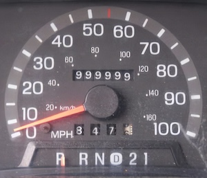

# Cyclic Groups and Generators

Cyclic groups and generators are fundamental concepts in cryptography,
particularly in public-private key exchange.

To understand how they apply to ZK, it's helpful to first understand how they
work in pure math - it will come in handy when consuming the rest of the
materials shared in [Learning Resources](./learning_resources.md).

## Groups

Before diving into cyclic groups, it's important to understand the basic
concept of a group.

A group is a set of elements with an _operation_ that combines any two elements
to form a third element, satisfying four conditions:

1. **Closure**: For any two elements in the group, the result of the operation
   is also in the group. E.g. the sum of two integers is an integer.
2. **Associativity**: The operation is associative, meaning that the order of
   operations does not matter. E.g. $(a + b) + c = a + (b + c)$.
3. **Identity**: There is an element in the group that, when combined with any
   other element, leaves it unchanged. E.g. $a + 0 = a$.
4. **Invertibility**: For every element in the group, there is an inverse
   element that, when combined with it, gives the identity element. E.g.
   $a + (-a) = 0$.

Instead of simple integer addition, in cryptography we often use modular
addition or modular multiplication.

## Finite Groups and Modular Arithmetic

Finite groups are groups with a finite number of elements. The whole set of
integers, for example, is an infinite group. In cryptography, modular arithmetic
is frequently used in finite groups, especially _modulo a prime number_.

Modular arithmetic is a system of calculations where numbers "wrap around" after
reaching a certain value. Think of it like a car's odometer, when it reaches
999999 it will wrap around to 0, so in an overly simplified way, a car's
odometer is in arithmetic _modulo 1000000_. In arithmetic modulo 7, the numbers
go from 0 to 6 and then wrap around to 0 again.

## Cyclic Groups

In a cyclic group, all elements can be generated by applying the group's
operation to a single element, called a _generator_.

Formally: a group is cyclic if there exists an element $g$ in the group such
that every element of the group can be expressed as $g^n$ (using the group's
operation) for some integer $n$. $G = \langle g \rangle$ means $G$ is generated
by $g$.

Combining with the above, finite cycling groups have elements that repeat in a
cycle as you apply the operation.

## Generators

A generator of a cyclic group is an element from which you can obtain every
other element of the group by applying the operation multiple times.

As an extremely simplified example building on top of the odometer analogy, the
odometer is a group of integers modulo 1000000, with the generator being 1 and
the operation being addition. You can get every element of the group by applying
the operation repeatedly, until it resets back to 0 after 999999.

In modular multiplication, for a group under modulo $p$, a generator $g$ is an
integer such that $(g^1, g^2, g^3, …, g^{p-1} \mod p)$ cycles through all
numbers from 1 to $^{p-1}$ without repetition.

### Order

Here we also need to get familiar with the concept of _order_. The order of an
element $g$ in a group is the smallest positive integer $n$ such that $g^n = i$
(where i is the identity element). For a generator of a cyclic group of order
$q$, $n = q$.

Basically, the smallest positive number of times you need to apply the group
operation to the element to return to the identity element. Or, in simpler
terms: an order is how many steps it takes for that element, when combined with
itself repeatedly, to cycle back to the starting point (the identity).

As a concrete example, imagine a clock with only the numbers 1 through 12. If
you start at 1 and repeatedly add 1, you get the sequence 1, 2, 3, ..., 12, 1.
The order of the element 1 is 12, because it takes 12 steps to return to the
starting point. If you want to check the order of element 3, you would go like
this: 3, 6, 9, 12, 0. After 4 steps, we ended up at the identity element again,
so the order of 3 is 4.

What about element 5? The remainder wraps around, so we have to take this into
account. As such, we will have:

1. $5 \mod 12 = 5$
2. $5 + 5 = 10 \mod 12 = 10$
3. $5 + 5 + 5 = 15 \mod 12 = 3$
4. $3 + 5 = 8 \mod 12 = 8$
5. $8 + 5 = 13 \mod 12 = 1$
6. $1 + 5 = 6 \mod 12 = 6$
7. $6 + 5 = 11 \mod 12 = 11$
8. $11 + 5 = 16 \mod 12 = 4$
9. $4 + 5 = 9 \mod 12 = 9$
10. $9 + 5 = 14 \mod 12 = 2$
11. $2 + 5 = 7 \mod 12 = 7$
12. $7 + 5 = 12 \mod 12 = 0$

Thus, the order of 5 is 12. The maximum order of any element in this group is
equal to the number of elements in the group, i.e. 12 (also known as the _order
of the group_ being 12). Try it out for order of element 7! Fun fact! The order
of any element also divides the order of the group.

!!! info "Sidenote: Z notation"

    If you're not familiar with the notation, $Z_p^*$ in the text below might look a
    bit confusing. It represents the set of integers ($Z$) from 1 to $p-1$ that are
    coprime to $p$ (i.e., they have no common factors with $p$ other than 1).

    To find all elements that are coprime to $p$, we can use the following steps:

    1. Check each number from 1 to $p-1$ to see if it is coprime to $p$.
    2. A number is coprime to $p$ if the greatest common divisor (GCD) of the number
    and $p$ is 1.

    For $p = 7$, the elements that are coprime to $p$ are: 1, 2, 3, 4, 5, 6.

    What if we look at, for example, $Z_{14}^*$?

    We need to figure out which numbers are coprime to 14, that is, which numbers GCD
    with 14 is 1.

    - $gcd(1, 14) = 1$
    - $gcd(2, 14) = 2$
    - $gcd(3, 14) = 1$
    - $gcd(4, 14) = 2$
    - $gcd(5, 14) = 1$
    - $gcd(6, 14) = 2$
    - $gcd(7, 14) = 7$
    - $gcd(8, 14) = 2$
    - $gcd(9, 14) = 1$
    - $gcd(10, 14) = 2$
    - $gcd(11, 14) = 1$
    - $gcd(12, 14) = 2$
    - $gcd(13, 14) = 1$

    So, ${Z}_{14}^* = {1, 3, 5, 9, 11, 13}$.

## Prime Order Cyclic Groups

The terms are coming together now! A group has **prime order** if the number of
elements (the order of the group) is a prime number. Prime order groups have
desirable properties in cryptography, such as the fact that every non-identity
element is a generator of the group. E.g.:

Let's play with out group $Z_7$ again:

- Elements: $\{0, 1, 2, 3, 4, 5, 6\}$
- Identity element: $0$
- Group order: 7 (prime!)
- Operation: Addition modulo 7

Let's show that every non-identity element is a generator.

- Order of 1: $1, 2, 3, 4, 5, 6, 0$ (7 steps)
- Order of 2: $2, 4, 6, 1, 3, 5, 0$ (7 steps)
- Order of 3: $3, 6, 2, 5, 1, 4, 0$ (7 steps)
- Order of 4: $4, 1, 5, 2, 6, 3, 0$ (7 steps)
- Order of 5: $5, 2, 6, 4, 1, 3, 0$ (7 steps)
- Order of 6: $6, 3, 1, 4, 2, 5, 0$ (7 steps)

In a larger group, we can have subgroups that are cyclic and of prime order,
and these are often used in cryptography to enhance security.

Let's consider ${Z}_{13}^*$.

- Elements: $\{1, 2, 3, 4, 5, 6, 7, 8, 9, 10, 11, 12\}$
- Identity element: $1$
- Group order: $12$ (since $13$ is prime and we exclude $0$)
- Operation: Multiplication modulo $13$

!!! info "Why do we exclude $0$?"

    Why do we exclude $0$? Because of the different operations used.

    Remember, groups need to have an identity element, which is defined as $(a + 0
    \equiv a \mod n)$ for addition and $(a \times 1 \equiv a \mod n)$ for
    multiplication. Additionally, zero has no multiplicative inverse $a^{-1}$ such
    that $(a \times a^{-1} \equiv 1 \mod n )$, which is necessary for the group
    operation to be defined in multiplication. In other words, there is no such
    element $b$ that satisfies $0 \times b \equiv 1 \mod n$.

    In multiplicative groups of prime $n$, $0$ is therefore always excluded and
    group order is always $n-1$.

In this group, not every non-identity element is a generator because the group
is not of prime order!

But! We can find subgroups of prime order that divide 12 (the order of the group).
The prime divisors of 12 are 2 and 3 so let's find subgroups of order 2 and 3.

Finding a subgroup of order 2 means finding elements $a$ where:

$a^2 \equiv 1 \mod 13, \quad \text{and} \quad a \ne 1$

It cannot be 1 because 1 is the identity element and will be included in the
subgroup by default.

So, we're looking for elements which, when squared (because "order 2"), are
equal to 1 modulo 13 (the remainder when their square is divided by 13 is 1).

Let's test $a = 12$:

$12^2 \equiv 144 \equiv 144 - 13 \times 11 = 144 - 143 = 1 \mod 13$

So, our subgroup of order 2 is $\{1, 12\}$.

!!! info

    We could test all other elements, but we can already see that 12 is a generator
    of this subgroup, because we can obtain every other element in the subgroup
    by repeatedly applying the group operation (in this case, multiplication
    modulo 13).

    For example, $12^2 = 144 \equiv 1 \mod 13$.

    $12^3 = 12 \times 12^2 = 12 \times 1 = 12 \mod 13$.

Now let's find a subgroup of order 3, so, three elements which, when cubed
(because "order 3") are equal to 1 modulo 13.

To save you the trouble, it's a subgroup consisting of ${1, 3, 9}$. Here's a
calculation of $a = 3$:

$3^1 = 3 \mod 13$

$3^2 = 9 \mod 13$

$3^3 = 27 \equiv 27 - 13 \times 2 = 27 - 26 = 1 \mod 13$

The last line uses the Modulus method: find the highest multiple of the Diviso3
(13) that is equal to or less than the Dividend (27). Then subtract the highest
Divisor from the Dividend: $27 - 26 = 1$.

Here is the calculation of $a = 9$:

$9^1 = 9 \mod 13$

$9^2 = 81 \equiv 81 - 13 \times 6 = 81 - 78 = 3 \mod 13$

$9^3 = 729 \equiv 729 - 13 \times 56 = 729 - 728 = 1 \mod 13$

You can try it out with other elements, but you'll find that they don't form a
complete cycle of the group.

## Generators, part 2

Okay, so where were we with generators? Let's get more concrete and wrap this
topic up.

In the above examples, we dealt with two groups:

- ${Z}_{13}^*$ - multiplicative group of integers modulo 13
- ${Z}_{7}$ - additive group of integers modulo 7

What is each group's _generator_?

In the additive group of integers modulo 7, ${Z}_{7}$, the generator is every
non-identity element (all elements from 1 to 6).

Example with $a = 1$:

$$
1 \times 1 \equiv 1 \mod 7 \\
$$

$$
1 \times 2 \equiv 2 \mod 7 \\
$$

$$
1 \times 3 \equiv 3 \mod 7 \\
$$

$$
1 \times 4 \equiv 4 \mod 7 \\
$$

$$
1 \times 5 \equiv 5 \mod 7 \\
$$

$$
1 \times 6 \equiv 6 \mod 7 \\
$$

$$
1 \times 7 \equiv 0 \mod 7 \ (\text{since } 7 \equiv 0 \mod 7)
$$

Example with $a = 3$:

$$
3 \times 1 \equiv 3 \mod 7 \\
$$

$$
3 \times 2 \equiv 6 \mod 7 \\
$$

$$
3 \times 3 \equiv 9 \equiv 2 \mod 7 \\
$$

$$
3 \times 4 \equiv 12 \equiv 5 \mod 7 \\
$$

$$
3 \times 5 \equiv 15 \equiv 1 \mod 7 \\
$$

$$
3 \times 6 \equiv 18 \equiv 4 \mod 7 \\
$$

$$
3 \times 7 \equiv 21 \equiv 0 \mod 7
$$

Again, all elements were generated, just in a different order (irrelevant here).

So the generator of cyclic group ${Z}_{7}$ is **every non-identity element**.

Finding generators of the multiplicative group of integers modulo 13,
${Z}_{13}^*$, is a bit more complicated.

First, we need to remember that elements of a multiplicative of order $k$ group
are elements of order $k$ known as _primitive roots modulo k+1_. The number of
primitive roots modulo a prime $p$ is $\phi(p - 1)$. This is known as
[Euler's totient function](https://www.dcode.fr/euler-totient).

$\phi(12) = \phi(2^2 \times 3) = 12 \times \left(1 - \frac{1}{2}\right) \times
\left(1 - \frac{1}{3}\right) = 4$

So there are 4 primitive roots modulo 13, so 4 generators. We find them by:

- listing divisors of the group order, which in our case are 1, 2, 3, 4, 6, 12.
- testing each, checking for each proper divisor $d$ of 12 (divisor that isn't
  12 itself), that it satisfies two conditions:
  1. $(a^{d} \not\equiv 1 \mod 13)$
  2. $(a^{12} \equiv 1 \mod 13)$ (holds for all elements, true by default)

Let's test $a = 2$:

- $d = 1$
    - $( 2^{1} \equiv 2 \mod 13 )$
    - $(2 \not\equiv 1 \mod 13 )$ ✅

- $d = 2$
    - $( 2^{2} \equiv 4 \mod 13 )$
    - $(4 \not\equiv 1 \mod 13 )$ ✅

- $d = 3$
    - $( 2^{3} \equiv 8 \mod 13 )$
    - $(8 \not\equiv 1 \mod 13 )$ ✅

- $d = 4$
    - $( 2^{4} \equiv 3 \mod 13 )$
    - $(3 \not\equiv 1 \mod 13 )$ ✅

- $d = 6$
    - $( 2^{6} \equiv 12 \mod 13 )$
    - $(12 \not\equiv 1 \mod 13 )$ ✅

We see that 2 is a generator of the group. Let's test $a = 3$:

- $d = 1$
    - $( 3^{1} \equiv 3 \mod 13 )$
    - $(3 \not\equiv 1 \mod 13 )$ ✅

- $d = 2$
    - $( 3^{2} \equiv 9 \mod 13 )$
    - $(9 \not\equiv 1 \mod 13 )$ ✅

- $d = 3$
    - $( 3^{3} \equiv 27 \equiv 1 \mod 13 )$
    - $(1 \not\equiv 1 \mod 13 )$ ❌

$a = 3$ is not a generator, as it failed on $d = 3$.

We can try it out with other elements and we will find that the others are 6, 7
and 11.

$$
g = {2, 6, 7, 11}
$$

## Conclusion

You've learned a lot of new concepts today! Just some of them are:

- Groups
- Cyclic groups
- Generators
- Order
- Prime order groups
- Subgroups
- Primitive roots
- Euler's totient function

As we continue learning about ZK, we will see how these concepts are used in
practice. Stay tuned!
